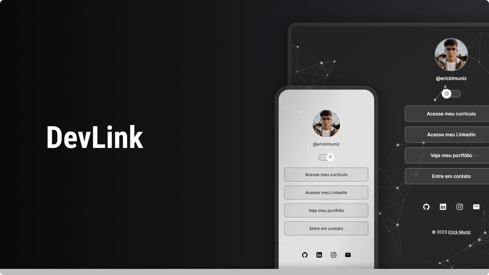

<h1 align="center"> DevLink </h1>

  

## 🚀 Tecnologias

Esse projeto foi desenvolvido com as seguintes tecnologias:

- HTML e CSS
- JavaScript
- Git e Github
- Figma

## 💻 Projeto

O DevLink é um agregador de links para usar como cartão de visitas online.

- [Acesse o projeto finalizado, online](https://ericklmuniz.github.io/DevLink/)

##

  © 2023
  <a href="https://www.linkedin.com/in/ericklmuniz/" target="_blank"
    >Erick Muniz</a>

